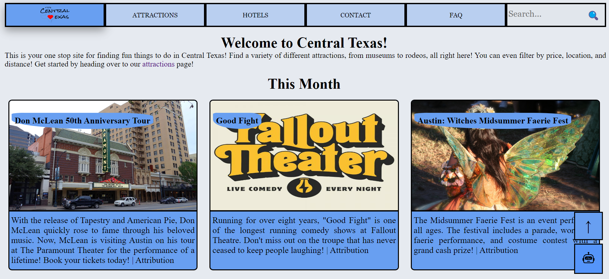
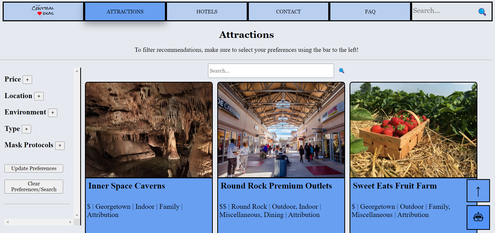
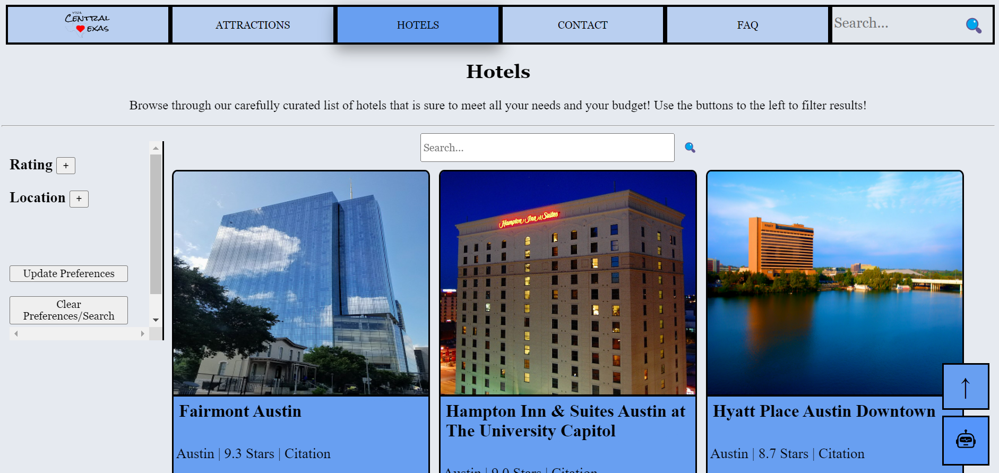
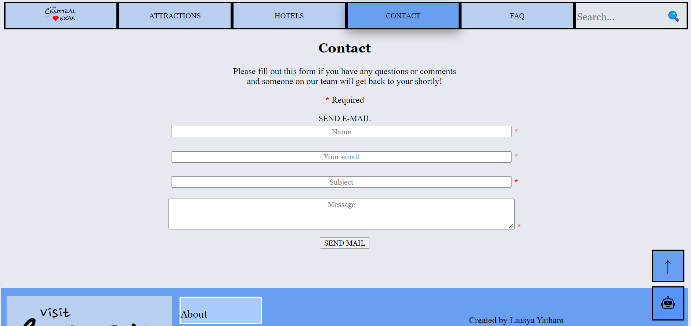
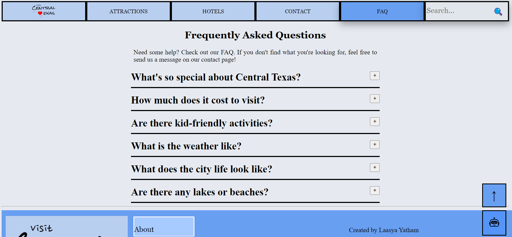
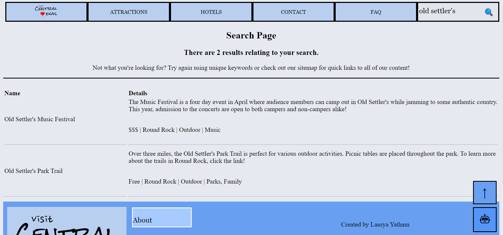
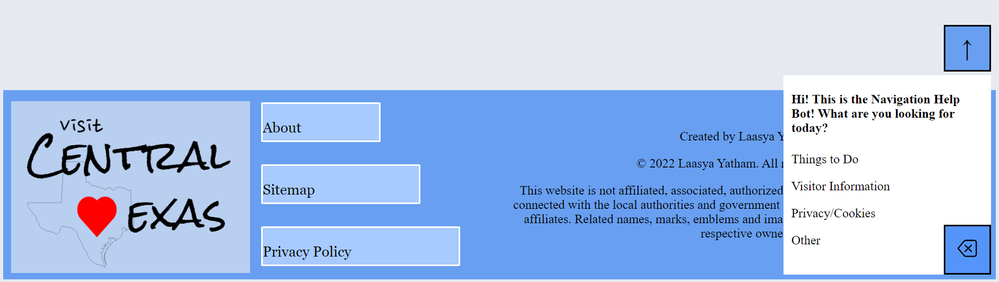

# Central Texas Tourism Recommendations
This is your one stop site for finding fun things to do in Central Texas! You can utilize this application in order to find dining, rich history, wonder in the great outdoors, and so much more! Get started
right now!

## What is it
This website is dynamic, and allows users to browse for attractions and hotels. They can then filter their results by location, price, indoor, outdoor, category, and mask protocols. Beyond that, you can also contact our team to get more information about a particular attraction. Be sure to check out the Frequently Asked Questions first!

### Home
The `Home` page describes what the website and Central Texas have to offer as well as navigation for the user. The menu bar located at the top of the page allows users to quickly move through the different parts of the website. The user can also view upcoming events from the current month.

### Attractions
The `Attractions` page displays various attractions. Using the bar to the left, users can select checkboxes to filter their results. Make sure to click the `Update Preferences` button at the bottom of the bar in order for your selection to work. When you select a checkbox, all activities of that type will be displayed, regardless of the other preferences chosen. Located underneath the `Update Preferences` button, there is also the `Clear Preferences` button to clear your selection. On the page itself, you will see individual blocks containing the name, an image, a blurb, and other details relating to the event. Users can search for specific attractions as well.

### Hotels
The `Hotels` page display hotels that the user can browse through. Similarly to the attractions page, the user can sort their results by rating and filter their results by location. They can also search for specific hotels. Individual blocks will show up with an image, link to the official hotel's website, as well as location and rating.

### Contact
The `Contact` page can be used to send an email to our team. General inquiries about attractions and the user's visit are welcome. The web page does not store the user's name or email, so there is no need to worry about the user's information being open to malicious hackers. You can read more about it through our [privacy policy](http://localhost:81/extra/privacy.php) Error messages will display below the `Send Mail` button if the input does not meet requirements.

### FAQ
The `FAQ` page displays frequently asked questions with answers and links to useful resources.

### Search 
The `Search` page is used to search the entire website. Users can search for any information relating to attractions, hotels, or upcoming events!

### Bottom Bar
This Bar exists at the bottom of all the pages in the website. It contains links to the about page, sitemap, and privacy policy. Our about page has information on visitor centers in Central Texas and our Sitemap contains an index of different content available. The Privacy Policy provides information on cookies, session data, and site security. It includes the copyright disclosure and disclaimer as well. There are also two buttons on the left hand side that exist on every page. The Up Arrow takes the user to the top of the page while the robot icon opens up a help navigation bot. This bot helps users by directing them to helpful pages based on survey questions, each dependent on the answer's response to the prior question.

## Sources
### Attraction Links
- [Inner Space Caverns](https://innerspacecavern.com/)
- [Round Rock Premium Outlets](https://www.premiumoutlets.com/outlet/round-rock)
- [Sweet Eats Fruit Farm](https://www.sweeteats.com/)
- [Chisholm Trail Crossing Park](https://www.roundrocktexas.gov/park/chisholm-trail-crossing-park/)
- [Lake Georgetown](https://visit.georgetown.org/lake-georgetown-2/)
- [State Capitol](https://tspb.texas.gov/prop/tc/tc/capitol.html)
- [Zilker Metropolitan Park](https://www.austintexas.gov/department/zilker-metropolitan-park)
- [Zilker Botanical Garden](https://zilkergarden.org/)
- [Round Rock Donuts](https://roundrockdonuts.com/)
- [Blanton Museum of Art](https://blantonmuseum.org/)
- [LBJ Library](https://www.lbjlibrary.org/)
- [George Washington Carver Museum](https://www.austintexas.gov/department/george-washington-carver-museum-cultural-and-genealogy-center)
- [UT Tower](https://tower.utexas.edu/)
- [Lady Bird Lake](https://www.austintexas.gov/page/lady-bird-lake)
- [Bullock Texas State History Museum](https://www.thestoryoftexas.com/)
- [Mexic-Arte Museum](https://mexic-artemuseum.org/)
- [Austin Nature and Science Center](https://www.austintexas.gov/department/austin-nature-science-center)
- [Museum of the Weird](https://www.museumoftheweird.com/)
- [Texas Military Forces Museum](https://www.texasmilitaryforcesmuseum.org/)
- [Peter Pan Mini Golf](https://peterpanminigolf.com/)
- [Women & Their Work](https://womenandtheirwork.org/)
- [Blue Starlite Drive-In Movie Theater](https://www.bluestarlitedrivein.com/downtown)
- [Waterloo Park](https://waterloogreenway.org/visit-waterloo-park/)
- [Moody Amphitheater](https://www.moodyamphitheater.com/)
- [Texas Music Museum](https://www.texasmusicmuseum.org/)
- [Ballet Austin](https://balletaustin.org/?_ga=2.137548656.1975296891.1647358249-1368057355.1647358249)
- [Haunted ATX](https://hauntedatx.com/)
- [Old Bakery and Emporium](https://www.austintexas.gov/department/old-bakery-and-emporium)
- [Austin City Hall](https://www.austintexas.gov/government/city-hall)
- [Fallout Theater](https://falloutcomedy.com/)
- [Old Settler’s Music Festival](https://oldsettlersmusicfest.org/)
- [Brushy Creek Trail](https://www.roundrocktexas.gov/city-departments/parks-and-recreation/parks-and-trails/trails/)
- [Old Settlers Park Trail](https://www.roundrocktexas.gov/city-departments/parks-and-recreation/parks-and-trails/trails/)
- [Gourdoughs](https://gourdoughs.com/)
- [Chilantro](https://www.chilantrobbq.com/)
- [Biscuits + Groovy](https://iwantbiscuits.com/)
- [Chuy’s](https://www.chuys.com/locations/austin/round-rock)
- [Bad Larry Burger Club](https://www.instagram.com/badlarryburgerclub/?hl=en)
- [Iron Works BBQ](https://www.ironworksbbq.com/)
- [Launderette](https://launderetteaustin.com/)
- [Hillside Farmacy](http://hillsidefarmacy.com/)
- [Lakeline Mall](https://www.simon.com/mall/lakeline-mall)
- [The Domain](https://www.simon.com/mall/the-domain)
- [Barton Springs Pool](https://www.austintexas.gov/department/barton-springs-pool)
- [Barton Creek Square](https://www.simon.com/mall/barton-creek-square)
- [Zip Lost Pines](https://ziplostpines.com/)
- [Rodeo Austin](https://rodeoaustin.com/)
- [ACL Live](https://acl-live.com/)
- [Emo’s Austin]( https://www.emosaustin.com/)
- [Scoot Inn Austin](https://scootinnaustin.com/)
- [Georgetown Palace Theater](https://www.georgetownpalace.com/)
- [Blue Hole Park](https://parks.georgetown.org/blue-hole/)

### Hotels Links
 - [Fairmont Austin](https://www.fairmont.com/austin/?cmpid=google_aus_search-brand-ww_branded-e-revsh&kpid=go_cmp-850421913_adg-42056489166_ad-430485489813_kwd-300169347291_dev-c_ext-_prd-&gclid=CjwKCAjwnZaVBhA6EiwAVVyv9LI1Yx2zP5q7yjGXWbwfXOwB1vn8RukBGzx0UbqdCsfa37nJR4LuphoCl30QAvD_BwE)
 - [Hampton Inn & Suites Austin at The University Capitol](https://www.guestreservations.com/Hampton-Inn-Suites-Austin-The-University-Capitol/booking?gclid=CjwKCAjwnZaVBhA6EiwAVVyv9JJ2XHHgGnAPNSTVtUta1z6xwi-cIH9Y-hwA2wA6T2loFlCESOd2xxoCJr8QAvD_BwE)
 - [Hyatt Place Austin Downtown](https://www.hyatt.com/en-US/hotel/texas/hyatt-place-austin-downtown/auszd?src=adm_sem_crp_chico_crp_ppc_NAM-UnitedStates-TX-Austin-HP-AUSZD_google_Evergreen2022_e_hyatt%20place%20austin%20downtown&gclid=CjwKCAjwnZaVBhA6EiwAVVyv9FEmyNdx1EM3Ww8AgFgwfEKmNCy4WIMOHrm8uLAcOXT_4Mk1DzZeuhoCgKYQAvD_BwE)
 - [Hilton Garden Inn Austin-Round Rock](https://www.hilton.com/en/locations/usa/texas/round-rock/hilton-garden-inn/?WT.mc_id=zlada0ww1gi2psh3ggl4advbpp5dkt6multibr7_153663322_1003528&gclid=CjwKCAjwnZaVBhA6EiwAVVyv9Gtl_u24xXEYLLFgt1IBHb93N8Z6okUB9BkcxaqjcfRUxsuBoI6TDhoCvTMQAvD_BwE&gclsrc=aw.ds)
 - [Holiday Inn Express & Suites Round Rock - Austin N](https://www.hiexpress.com/hotels/us/en/find-hotels/hotel/list?fromRedirect=true&qSrt=sBR&qIta=99504425&icdv=99504425&qDest=Round%20Rock,%20TX,%20United%20States&setPMCookies=true&dp=true&gclid=CjwKCAjwnZaVBhA6EiwAVVyv9CWh2EBG5HyOyY5NxGGWeSnSVN1o2On5tpJYX4B1z13Q6F2lEV_dtRoCo-8QAvD_BwE&cm_mmc=PDSEA-_-G_F-AMER_FS-USA_H-AMER_HS-USA_EX_BRI_EXM_HOTEL-RNDRK&srb_u=1)
 - [Country Inn & Suites by Radisson - Round Rock - TX](https://www.radissonhotelsamericas.com/en-us/hotels/country-inn-round-rock-tx?facilitatorId=GOOGLE&cid=a:ps+b:ggl+c:amer+e:cis+d:us+f:en-US+g:ho+h:TXROUND&gclid=CjwKCAjwnZaVBhA6EiwAVVyv9IoBSsT0WyIVbZ13s9ShzzevKTK5zr0yOmRFQ28xpbGhi5kbBvrk3hoClYsQAvD_BwE)
 - [The Ruby Hotel & Bar](https://therubyhotel.com/rooms?gclid=CjwKCAjwnZaVBhA6EiwAVVyv9O8TQmvHgMVIlwPs7CAemghe2ekn80cV4jH2fnyN5JmVGF7KddziSBoCFzgQAvD_BwE)
 - [South Congress Hotel](https://southcongresshotel.com/)
 - [Best Western Plus Georgetown Inn & Suites](https://www.bestwestern.com/en_US/book/hotel-rooms.44689.html?iata=00171880&ssob=BLBWI0004G&cid=BLBWI0004G:google:gmb:44689)
 - [Sheraton Austin Georgetown Hotel & Conference Center](https://www.marriott.com/en-us/hotels/ilegt-sheraton-austin-georgetown-hotel-and-conference-center/overview/)

### Upcoming Events  Links
 - [Don McLean 50th Anniversary Tour](https://tickets.austintheatre.org/7559/7560)
 - [H-E-B Austin Symphony July 4th Concert & Fireworks](https://www.kmfa.org/pages/3652-austin-symphony-orchestra-heb-july-4th-concert-fireworks)
 - [Nitro Circus at Dell Diamond](https://www.milb.com/round-rock/fans/nitro-circus)
 - [Sean Kingston - The Road to Deliverance Tour](https://www.prekindle.com/event/75117-sean-kingston-austin)
 - [Y'all We Asian](https://falloutcomedy.com/shows/yall-we-asian/)
 - [Good Fight](https://falloutcomedy.com/shows/good-fight-2/)
 - [Fleet Foxes: Shore Tour](https://www.moodyamphitheater.com/events/fleet-foxes)
 - [Big Time Rush: Forever Tour](https://www.moodyamphitheater.com/events/big-time-rush)
 - [Father John Misty](https://www.moodyamphitheater.com/events/father-john-misty)
 - [ACL Radio & Long Center Present: The Drop In](https://thelongcenter.org/upcoming-calendar/?gclid=Cj0KCQjw-daUBhCIARIsALbkjSZYXK7n6hxZbP54mwOncDwojsSCfZSV_TSU38FL8lvqxpEc7G9HU_kaAtA2EALw_wcB)
 - [Austin: Witches Midsummer Faerie Fest](https://txartisan.com/all-events/austin-witches-midsummer-faerie-fest/)

### FAQ Links
- [Expedia](https://www.expedia.com/)
- [Tripadvisor](https://www.tripadvisor.com/)
- [Trivago](https://www.trivago.com/)

### Images
 - All Images issued under a Creative Commons License have been given proper accreditation within the website itself, including the citation with a link to the original image/license.

### Copyrighted Images

#### Hotels
- Management. Hilton Garden Inn Austin-Round Rock. Unknown. Hilton, https://www.hilton.com/en/hotels/ausrrgi-hilton-garden-inn-austin-round-rock/?WT.mc_id=zlada0ww1gi2psh3ggl4advbpp5dkt6multibr7_153663322_1003528&gclid=CjwKCAjwnZaVBhA6EiwAVVyv9Gtl_u24xXEYLLFgt1IBHb93N8Z6okUB9BkcxaqjcfRUxsuBoI6TDhoCvTMQAvD_BwE&gclsrc=aw.ds
- Management. Holiday Inn Express & Suites Round Rock - Austin North. Unknown. IHG Hotels & Resorts, https://www.ihg.com/holidayinnexpress/hotels/us/en/round-rock/rndes/hoteldetail
- Management. Country Inn & Suites by Radisson, Round Rock, TX. Unknown. Country Inn Suites, https://country-inn-suites.com/usa-hotels/texas/round-rock/
- Management. The Ruby Hotel & Bar. Unknown. The Ruby Hotel, https://therubyhotel.com/gallery
- Management. South Congress Hotel - A Boutique Hotel in Austin, Texas. Unknown. South Congress Hotel, https://southcongresshotel.com/
- Management. Best Western Plus Georgetown Inn & Suits. Unknown. Best Western, https://www.bestwestern.com/en_US/book/hotel-rooms.44689.html?iata=00170230&ssob=BLPBM0001G&checkIn=2022-06-26&checkOut=2022-06-27&rooms=1&adults=2&children=0&utm_content=BA&cid=BLPBM0001G:tripadvisor:HWS:44689&refid=fb36f4fd-0f75-4318-9fd5-b9d43258dd89
- Management. Sheraton Austin Georgetown Hotel & Conference Center. Unknown. Marriott, https://www.marriott.com/en-us/hotels/ilegt-sheraton-austin-georgetown-hotel-and-conference-center/photos/

#### Attractions
- Management. Round Rock Premium Outlets. 2019. Go Round Rock, https://goroundrock.com/get-fall-ready-at-round-rock-premium-outlets/
- Management. Old Settlers Park. Unknown. Round Rock Texas, https://www.roundrocktexas.gov/city-departments/parks-and-recreation/old-settlers-park/
- Management. Domain NORTHSIDE. Unknown. Endeavor, https://www.endeavor-re.com/properties/domain-northside/
- Management. Barton Creek Square. 2019. The Business Journals, https://www.bizjournals.com/austin/news/2019/02/15/why-simon-is-overhauling-barton-creek-square-mall.html
- Management. Zip Lost Pines. Unknown. Zip Lost Pines, https://ziplostpines.com/

### Templates

#### Canva Slideshow Template
- Management. "Yellow Black White Modern Doodle UI Computer Pitch Deck Marketing Presentation". Canva, 21 June 2022 https://www.canva.com/design/DAFEvL5aG4Q/kOCoTIETjEb4ItMUfwOPmA/view?utm_content=DAFEvL5aG4Q&utm_campaign=designshare&utm_medium=link&utm_source=publishsharelink&mode=preview

## Languages, Tools, & Softwares Used
- Visual Studio Code
- Task Scheduler
- Node.js
- MAMP
- phpMyAdmin
- hMailServer
- Github
- Github Desktop
- Javascript
- PHP
- MySQL
- HTML
- CSS

## Disclaimer
This project is not affiliated, associated, authorized, endorsed by, or in any way officially connected with the local authorities and government of Texas or any of its subsidiaries or its affiliates. Related names, marks, emblems and images are registered trademarks of their respective owners.

## License
- &copy; 2022 Laasya Yatham. All rights reserved.

## Contributors
- Laasya Yatham

