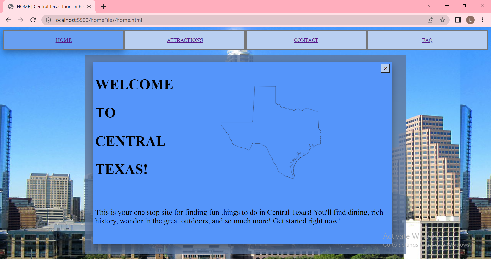
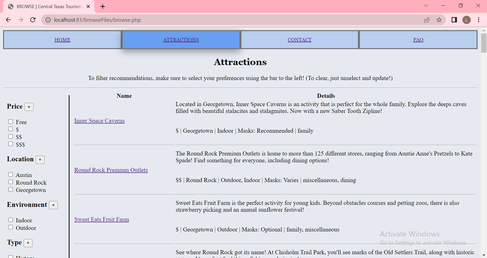
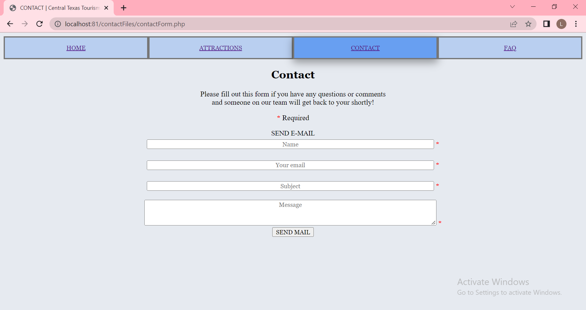
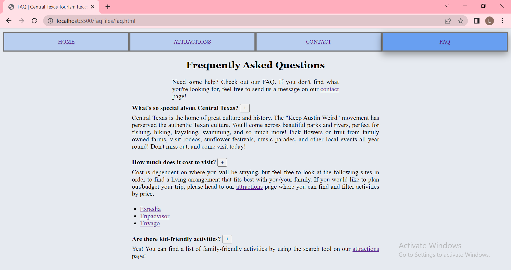

# Central Texas Tourism Recommendations
This is your one stop site for finding fun things to do in Central Texas! You can utilize this application in order to find dining, rich history, wonder in the great outdoors, and so much more! Get started
right now!

## What is it
This website is dynamic, and allows users to browse for attractions. They can then filter their results by location, price, indoor, outdoor, category, and mask protocols. Beyond that, you can also contact our team to get more information about a particular attraction. Be sure to check out the Frequently Asked Questions first!

### Home
The `Home` page describes what the website and Central Texas have to offer as well as navigation for the user. The menu bar located at the top of the page allows users to quickly move through the different parts of the website.

### Attractions
The `Attractions` page displays various attractions. Using the bar to the left, users can select checkboxes to filter their results. Make sure to click the `Update Preferences` button at the bottom of the bar in order for your selection to work. When you select a checkbox, all activities of that type will be displayed, regardless of the other preferences chosen. Located underneath the `Update Preferences` button, there is also the `Clear Preferences` button to clear your selection. On the page itself, you will see a table containing a list of all the desired attractions. In the `Name` column, there are clickable links to all of the activities' official websites. In the `Details` column, you should see a quick blurb about the attraction as well as more information corresponding to the filters.

### Contact
The `Contact` page can be used to send an email to our team. General inquiries about attractions and the user's visit are welcome. The web page also passes the information securely, so there is no need to worry about the user's information being open to malicious hackers. Error messages will display below the `Send Mail` button if the input does not meet requirements.

### FAQ
The `FAQ` page displays frequently asked questions with answers and links to useful resources.

## Sources
### Attraction Links
- [Inner Space Caverns](https://innerspacecavern.com/)
- [Round Rock Premium Outlets](https://www.premiumoutlets.com/outlet/round-rock)
- [Sweet Eats Fruit Farm](https://www.sweeteats.com/)
- [Chisholm Trail Crossing Park](https://www.roundrocktexas.gov/park/chisholm-trail-crossing-park/)
- [Lake Georgetown](https://visit.georgetown.org/lake-georgetown-2/)
- [State Capitol](https://tspb.texas.gov/prop/tc/tc/capitol.html)
- [Zilker Metropolitan Park](https://www.austintexas.gov/department/zilker-metropolitan-park)
- [Zilker Botanical Garden](https://zilkergarden.org/)
- [Round Rock Donuts](https://roundrockdonuts.com/)
- [Blanton Museum of Art](https://blantonmuseum.org/)
- [LBJ Library](https://www.lbjlibrary.org/)
- [George Washington Carver Museum](https://www.austintexas.gov/department/george-washington-carver-museum-cultural-and-genealogy-center)
- [UT Tower](https://tower.utexas.edu/)
- [Lady Bird Lake](https://www.austintexas.gov/page/lady-bird-lake)
- [Bullock Texas State History Museum](https://www.thestoryoftexas.com/)
- [Mexic-Arte Museum](https://mexic-artemuseum.org/)
- [Austin Nature and Science Center](https://www.austintexas.gov/department/austin-nature-science-center)
- [Museum of the Weird](https://www.museumoftheweird.com/)
- [Texas Military Forces Museum](https://www.texasmilitaryforcesmuseum.org/)
- [Peter Pan Mini Golf](https://peterpanminigolf.com/)
- [Women & Their Work](https://womenandtheirwork.org/)
- [Blue Starlite Drive-In Movie Theater](https://www.bluestarlitedrivein.com/downtown)
- [Waterloo Park](https://waterloogreenway.org/visit-waterloo-park/)
- [Moody Amphitheater](https://www.moodyamphitheater.com/)
- [Texas Music Museum](https://www.texasmusicmuseum.org/)
- [Ballet Austin](https://balletaustin.org/?_ga=2.137548656.1975296891.1647358249-1368057355.1647358249)
- [Haunted ATX](https://hauntedatx.com/)
- [Old Bakery and Emporium](https://www.austintexas.gov/department/old-bakery-and-emporium)
- [Austin City Hall](https://www.austintexas.gov/government/city-hall)
- [Fallout Theater](https://falloutcomedy.com/)
- [Old Settler’s Music Festival](https://oldsettlersmusicfest.org/)
- [Brushy Creek Trail](https://www.roundrocktexas.gov/city-departments/parks-and-recreation/parks-and-trails/trails/)
- [Old Settlers Park Trail](https://www.roundrocktexas.gov/city-departments/parks-and-recreation/parks-and-trails/trails/)
- [Gourdoughs](https://gourdoughs.com/)
- [Chilantro](https://www.chilantrobbq.com/)
- [Biscuits + Groovy](https://iwantbiscuits.com/)
- [Chuy’s](https://www.chuys.com/locations/austin/round-rock)
- [Bad Larry Burger Club](https://www.instagram.com/badlarryburgerclub/?hl=en)
- [Iron Works BBQ](https://www.ironworksbbq.com/)
- [Launderette](https://launderetteaustin.com/)
- [Hillside Farmacy](http://hillsidefarmacy.com/)
- [Lakeline Mall](https://www.simon.com/mall/lakeline-mall)
- [The Domain](https://www.simon.com/mall/the-domain)
- [Barton Springs Pool](https://www.austintexas.gov/department/barton-springs-pool)
- [Barton Creek Square](https://www.simon.com/mall/barton-creek-square)
- [Zip Lost Pines](https://ziplostpines.com/)
- [Rodeo Austin](https://rodeoaustin.com/)
- [ACL Live](https://acl-live.com/)
- [Emo’s Austin]( https://www.emosaustin.com/)
- [Scoot Inn Austin](https://scootinnaustin.com/)
- [Georgetown Palace Theater](https://www.georgetownpalace.com/)
- [Blue Hole Park](https://parks.georgetown.org/blue-hole/)

### FAQ Links
- [Expedia](https://www.expedia.com/)
- [Tripadvisor](https://www.tripadvisor.com/)
- [Trivago](https://www.trivago.com/)

### Home Images
- [History Image of Texas State Capitol (LoneStarMike - Own Work - CC BY 3.0)](https://commons.wikimedia.org/wiki/File:TexasStateCapitol-2010-01.JPG)
- [Music Image of ACL Concert (Austin Party Bus Rental - WikiMedia Commons CC BY 3.0)](https://creativecommons.org/licenses/by/3.0/us/)
- [Outdoors Image of Lake Georgetown Park (Austex - Own Work - CC BY SA 3.0)](https://commons.wikimedia.org/wiki/File:GeorgetownParksBH.jpg)

## Tools & Softwares Used
- Visual Studio Code
- Node.js
- MAMP
- phpMyAdmin
- hMailServer
- Github
- Github Desktop
- Javascript
- PHP
- MySQL
- HTML
- CSS

## Disclaimer
This project is not affiliated, associated, authorized, endorsed by, or in any way officially connected with the local authorities and government of Texas or any of its subsidiaries or its affiliates. Related names, marks, emblems and images are registered trademarks of their respective owners.

## License
- [Creative Commons Attribution-NonCommercial-NoDerivatives 4.0 International Public License](https://creativecommons.org/licenses/by-nc-nd/4.0/)

## Contributors
- Laasya Yatham

